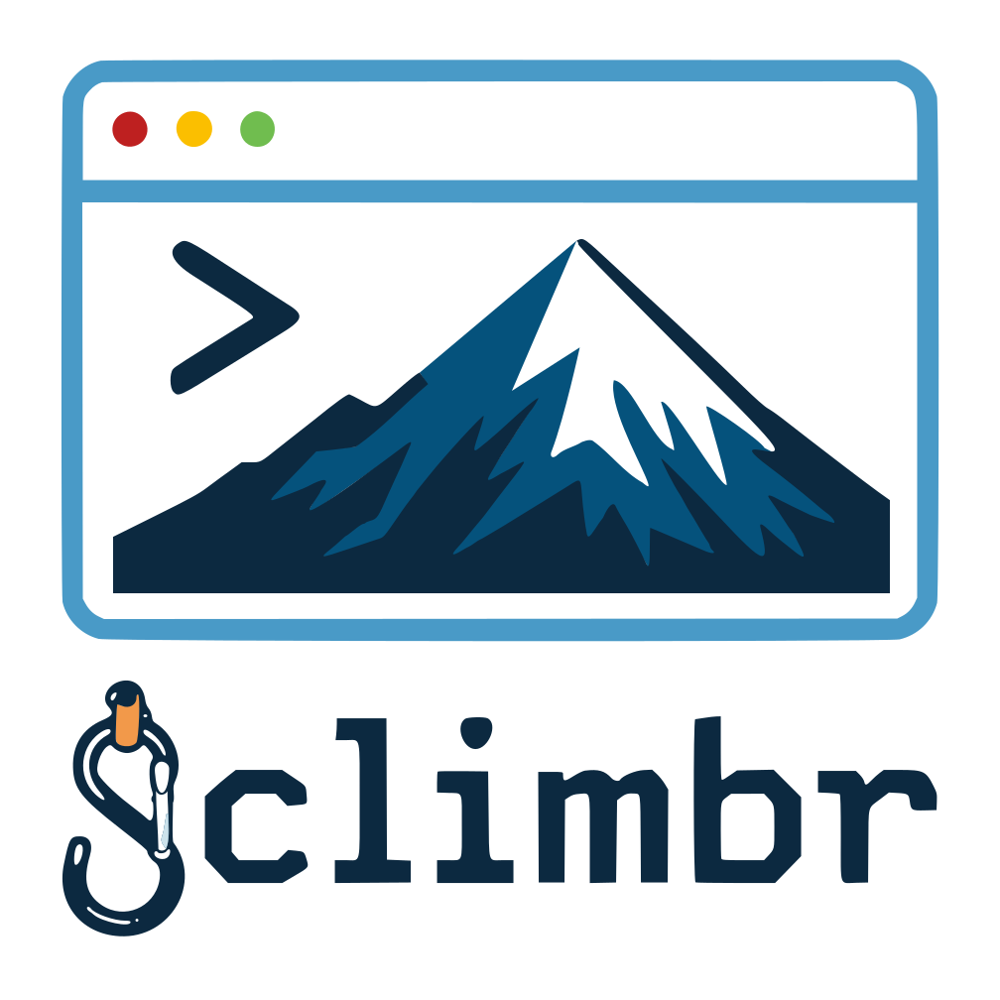

# Climbr


> A Node.js CLI framework that handles the mountain, so you can focus on the summit.

Climbr is an opinionated TypeScript-first framework for building Node.js CLI tools. It takes care of command wiring, persistent configuration, interactive prompts, and output formatting — so you can spend your time on what your CLI actually does.

## Packages

| Package | Description |
|---|---|
| [`@climbr/core`](./packages/core) | The framework — auto-discovery, config system, CLI utilities |
| [`climbr-demo`](./packages/demo) | Reference CLI that exercises the framework |

## Development

This repository is an npm workspace monorepo. All commands run from the root.

```bash
# Install dependencies
npm install

# Build all packages
npm run build

# Lint all packages
npm run lint

# Format all packages
npm run format
```

To work on a single package, use the `-w` flag:

```bash
npm run build -w packages/core
```

## AI Usage Disclosure

Parts of this project were developed with the assistance of [Claude Code](https://claude.ai/code) (Anthropic). AI was used in the following capacities:

- **Documentation** — reviewing and completing README files and inline JSDoc comments across the codebase
- **Reference implementation** — initial scaffolding of `@climbr/demo`, subsequently revised by the author
- **Imagery** — The logo was created with the assistance of ChatGPT.
- **Maintenance tasks** — suggesting improvements such as `package.json` metadata (keywords, author, script additions) and `tsconfig` structure
- **Workspace bootstrap** — setting up shared configuration files including ESLint, Prettier, and root `tsconfig`

All AI-generated output was reviewed and approved by the author before being committed. The architecture, design decisions, and core implementation of the framework are the work of the author.
